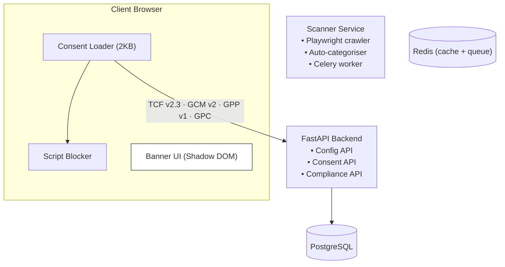

<p align="center">
  
</p>

<h1 align="center">Privacy infrastructure for the modern web</h1>

<p align="center">
  A self-hosted, multi-tenant cookie consent management platform.<br>
  Source-available alternative to OneTrust, Cookiebot and CookieYes.
</p>

<p align="center">
  <a href="https://github.com/consentos/consentos/actions"></a>
  <a href="LICENSE"></a>
  <a href="https://consentos.dev"></a>
</p>

---

ConsentOS gives you a single `<script>` tag to embed on your site and a self-hosted dashboard to manage everything behind it: consent collection, cookie blocking, scanning, compliance checking, and audit trails. The full surface — banner, API, scanner, admin UI — is in this repository, with no SaaS lock-in.

## Why ConsentOS

- **Privacy by design, not by default.** Consent is given, not assumed. Auto-blocking is on by default; visitors don't get tracked until they opt in.
- **Standards-complete.** IAB TCF v2.3, GPP v1 (six US state sections), Google Consent Mode v2, GPC, Shopify Customer Privacy API.
- **Yours to host.** Source-available under the Elastic Licence 2.0 — you can self-host indefinitely, modify freely, and run it on your own infrastructure.
- **Built for compliance teams.** Rule-based compliance checks for GDPR, CNIL, CCPA/CPRA, ePrivacy and LGPD, plus a tamper-evident consent record audit trail.
- **Multi-tenant from day one.** Organisations, sites, role-based access. Configuration cascades System → Org → Site Group → Site → Region.

## Features

- **Consent banner** — ~2KB loader + ~26KB bundle, gzipped, rendered in a Shadow DOM root for total style isolation
- **Auto-blocking** — intercepts script creation, cookie writes, and storage API calls until consent is granted; releases per-category
- **Cookie scanner** — Playwright-driven crawl with auto-categorisation against the [Open Cookie Database](https://github.com/jkwakman/Open-Cookie-Database) (2,200+ patterns)
- **Dark pattern detection** — flags pre-ticked boxes, missing reject buttons, button asymmetry, scroll-based dismissal
- **Compliance engine** — rules for GDPR, CNIL, CCPA/CPRA, ePrivacy, LGPD with severity scoring
- **Configuration cascade** — defaults → org → site group → site → regional override
- **Display modes** — bottom banner, top banner, overlay modal, corner popup, inline
- **Consent withdrawal** — persistent floating button so visitors can change their mind (GDPR Art. 7(3))
- **i18n-ready banner** — translations API per site, locale auto-detection
- **GeoIP-aware** — region-specific consent modes (opt-in for EU, opt-out for US-CA, etc.)

## Architecture



## Quick start

### Prerequisites

- Docker and Docker Compose v2.15+
- Node.js 20+ and npm
- Python 3.12+ and [uv](https://docs.astral.sh/uv/)

### Setup

```bash
# Clone and configure
git clone https://github.com/consentos/consentos.git
cd consentos
cp .env.example .env

# Set the initial admin credentials in .env before the next step. These
# are used once on first run to provision your login; you can rotate
# the password from the admin UI afterwards.
#   INITIAL_ADMIN_EMAIL=you@example.com
#   INITIAL_ADMIN_PASSWORD=change-me-immediately

# Start the dev environment
make up

# Run migrations, create the initial admin + organisation, seed cookies
make seed
```

You can now log in at `http://localhost:5173` with the credentials you set above.

| Service   | URL                        |
|-----------|----------------------------|
| API docs  | http://localhost:8000/docs |
| Admin UI  | http://localhost:5173      |

The admin UI dog-foods the banner script at `http://localhost:5173/banner/consent-loader.js`. In production you'd publish those files to a CDN and point `CDN_BASE_URL` at it.

### Upgrading from PostgreSQL 16

The dev compose ships `postgres:17-alpine`. If your `consentos_pgdata` volume was initialised on an earlier major (e.g. `postgres:16-alpine`), the postgres container fails to start with:

```
FATAL: database files are incompatible with server
DETAIL: The data directory was initialized by PostgreSQL version 16
```

`make up` runs a precheck that surfaces this before the container fails. Two recovery paths:

**Path A: local dev where data is throwaway**

```bash
make down
docker volume rm consentos_pgdata
make up
make seed
```

**Path B: preserve data via dump and restore**

```bash
make down

# Dump from the old volume using a one-shot PG16 container
docker run --rm -d --name pg16 \
  -v consentos_pgdata:/var/lib/postgresql/data \
  -e POSTGRES_USER=consentos -e POSTGRES_PASSWORD=consentos \
  postgres:16-alpine
sleep 5
docker exec pg16 pg_dumpall -U consentos > pgdata-backup.sql
docker stop pg16

# Recreate volume on PG17 and restore
docker volume rm consentos_pgdata
docker compose up -d postgres
sleep 5
cat pgdata-backup.sql | docker exec -i consentos-postgres-1 psql -U consentos -d postgres

make up
```

If you run a Kubernetes deployment (helm chart), follow your cloud provider's managed-Postgres major-version upgrade procedure instead. The volume-level recipe above only applies to the docker-compose deployment.

### Creating additional organisations

`make seed` provisions a single organisation and owner. To create more tenants later:

1. Set `ADMIN_BOOTSTRAP_TOKEN` in `.env` to a strong random value (`openssl rand -hex 32`) and restart the API
2. `curl -X POST http://localhost:8000/api/v1/organisations/ -H "X-Admin-Bootstrap-Token: <your-token>" -H "Content-Type: application/json" -d '{"name": "Acme", "slug": "acme"}'`
3. Unset or rotate `ADMIN_BOOTSTRAP_TOKEN` once you're done — leaving it set means anyone with the value can keep creating tenants.

### Running tests

```bash
make test-infra-up   # Start test PostgreSQL + Redis
make test            # Run API tests
make test-cov        # With coverage
make test-infra-down # Tear down
```

Banner and admin UI tests:

```bash
cd apps/banner && npm test
cd apps/admin-ui && npm test
```

## Project structure

```
consentos/
├── apps/
│   ├── api/            # FastAPI backend (Python)
│   ├── scanner/        # Playwright cookie scanner (Python)
│   ├── banner/         # Consent banner script (TypeScript)
│   └── admin-ui/       # Admin dashboard (React + TypeScript)
├── assets/brand/       # Logo, palette, brand guidelines
├── helm/               # Kubernetes Helm chart
├── sdks/               # Mobile SDKs (iOS, Android)
├── docker-compose.yml  # Development environment
└── Makefile
```

## Technology

| Layer     | Stack                                                   |
|-----------|---------------------------------------------------------|
| API       | Python 3.12, FastAPI, SQLAlchemy 2.0 (async), Alembic   |
| Scanner   | Python 3.12, Playwright, Celery                         |
| Banner    | TypeScript, Rollup, Shadow DOM                          |
| Admin UI  | React 19, Vite, shadcn/ui, TailwindCSS, TanStack Query  |
| Database  | PostgreSQL 16                                           |
| Cache     | Redis 7                                                 |
| Infra     | Docker Compose, Kubernetes (Helm), Ansible              |

## Known cookies database

ConsentOS ships with the [Open Cookie Database](https://github.com/jkwakman/Open-Cookie-Database) — a community-maintained catalogue of 2,200+ cookie patterns used for auto-categorisation during scans. To update:

```bash
curl -L https://raw.githubusercontent.com/jkwakman/Open-Cookie-Database/master/open-cookie-database.csv \
  -o apps/api/data/open-cookie-database.csv
make seed
```

## Contributing

See [CONTRIBUTING.md](CONTRIBUTING.md) for setup instructions, coding standards, and PR guidelines. We follow [Conventional Commits](https://www.conventionalcommits.org/) and write everything in British English.

## Security

To report a vulnerability, see [SECURITY.md](SECURITY.md). Please do not open public issues for security reports.

## Anonymous telemetry

Self-hosted ConsentOS sends a single anonymous heartbeat once a day with deployment metadata and bucketed scale numbers — no consent records, no domains, no user data. It helps the project know which versions are still running and which features matter.

Disable with `TELEMETRY_ENABLED=false`. See [docs/telemetry.md](docs/telemetry.md) for the full payload schema and how to audit what was sent.


## Licence

ConsentOS is licensed under the [Elastic Licence 2.0 (ELv2)](LICENSE) — a source-available licence.

You may **use, copy, distribute, and modify** the software freely, with two restrictions:

1. You may not provide it to third parties as a hosted or managed service
2. You may not circumvent any licence key functionality

This means: self-host it on your own infrastructure as much as you like; offer it to your customers as part of a wider product; modify it to your heart's content. You just can't resell ConsentOS itself as a SaaS — that's how the project sustains itself.

The known cookies database (`apps/api/data/open-cookie-database.csv`) is sourced from the [Open Cookie Database](https://github.com/jkwakman/Open-Cookie-Database) under [CC BY 4.0](https://creativecommons.org/licenses/by/4.0/).

See the [LICENSE](LICENSE) file for the full licence text and copyright notice.
